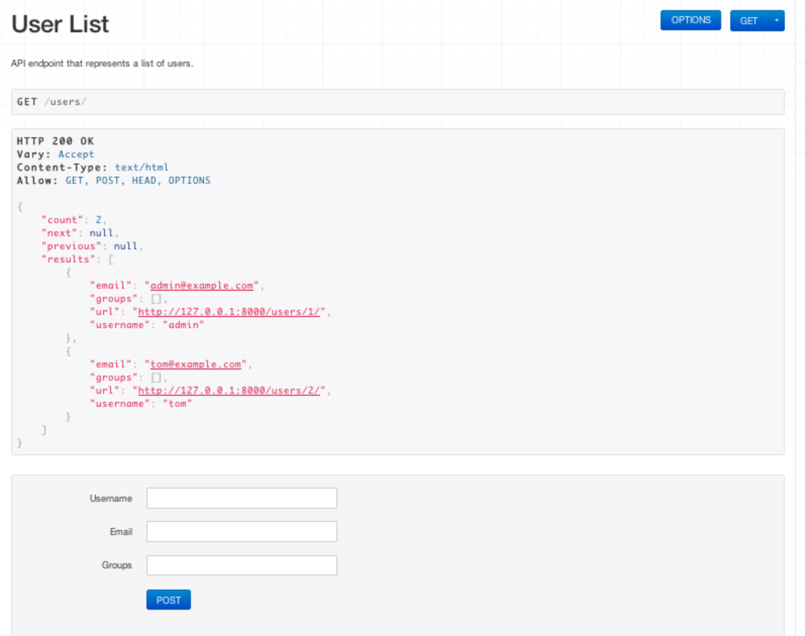
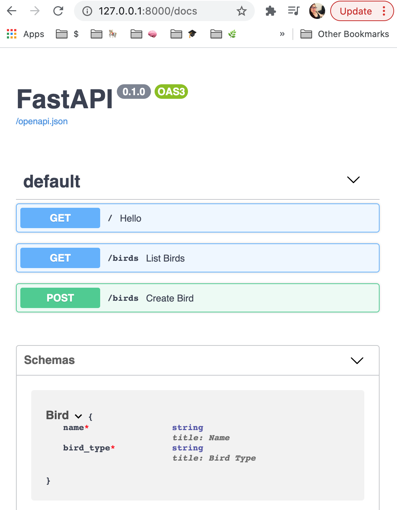

# Choose a Python framework to build an API

Suppose you need to build a backend API to serve data to a mobile app or to a frontend website. You and your team plan to use Python for this server. Which Python framework should you choose?

You have several options, each of which offers unique strengths. Let&#39;s compare four choices: two that are well-known and two newer frameworks.

## Django-Rest

If you ever wrote an API in [Ruby on Rails](https://www.linode.com/docs/guides/development/ror/), Spring with Kotlin or Java, or Nancy for .Net, then Django will feel familiar.

After [installing Django](https://docs.djangoproject.com/en/3.1/intro/install/) and [django rest framework](https://www.django-rest-framework.org/tutorial/quickstart/), navigate to the directory where you want to develop your API and generate a Django project with this command:

```
django-admin startproject my-api
django-admin startapp api
```

That command generates a collection of files and nested directories, like so:

```
my-api/
    manage.py
    api/
        __init__.py
        settings.py
        urls.py
        asgi.py
        wsgi.py
```

This project (`my-api`) has one application (`api`) in it. It can contain several separate apps for different resources or services, if necessary. Add new routes, views, and models by editing the appropriate files. The [documentation](https://docs.djangoproject.com/en/3.1/) is essential for showing exactly where to put the code for a given feature because there is too much in this framework to memorize.

Django is by far the _heaviest_ of the four frameworks discussed here, and it requires the most up-front familiarity to use. That said, it also comes with the most built-in functionality. For example, it has its own _template engine_ if you need to build a UI. It comes with an object-relational mapper (ORM), and it handles database migrations automatically from model schema changes. It provides an admin interface out of the box, with a UI that you can use to add objects to the database.

You also automatically get a UI for trying out your endpoints for each of your resources—in this example, a user:



Django-rest is an excellent option if your API needs to integrate with multiple databases, handle complex and numerous schema migrations, benefit from admin capabilities, or provide discovery endpoints. It should probably be a frontrunner framework for applications that serve enterprise needs. Its division of responsibilities also provides built-in structure for separating the changes of several developers working on the app simultaneously, which minimizes merge conflicts. For a slim, minimalist REST API, it&#39;s not the right choice.

## Flask

Flask is the best-known and currently most popular Python API micro-frameworks—minimalist dependencies that boast the ability to get a server running with just one file and a few lines of code.

A Flask app with a single &quot;Hello, world!&quot; endpoint can live in one file and look like this:

```
from flask import Flask
app = Flask(__name__)

@app.route('/')
def hello_world():
    return 'Hello, World!'
```

Unlike Django, Flask doesn&#39;t come with every possible contingency built into the library. So if the app necessitates HTML templates, for example, it has to rely on an additional dependency. The same would be true of a database integration, and an admin interface would have to be done from scratch.

That said, for a REST app that does not need those things, Flask provides a fast start and a lot of capacity for iterating on the original design. For this reason, Flask frequently undergirds services that provide the results of machine learning models developed in Python. The same folks who work on the models can maintain their services in the same language with minimal upfront investment of time for learning.

Flask also has an immense body of documentation and video tutorials. So for versatility, Flask has an advantage over similar microframeworks, just by dint of so much having been said about how to use it.

## FastAPI

FastAPI is a newer option that looks a lot like Flask. A single &quot;Hello, world!&quot; endpoint in FastAPI looks like this:

```
from fastapi import FastAPI

app = FastAPI()

@app.get('/')
def hello_world():
   return {'Hello' : 'world!'}
```

Because it&#39;s newer and less widely used, FastAPI doesn&#39;t have the organic documentation growth around it that Flask does. But it does carry a few distinct operational advantages. First, Flask is built for asynchronicity by default, so developers don&#39;t have to do extra rigamarole to use async and await in their endpoints. This opens up options for building a speedy API with less overhead than Flask or Django.

FastAPI also relies on type hints to automatically serialize between models and JSON. As a result, this is all it takes to convert between Bird models from a database and a JSON response:

```
class Bird(BaseModel):
   name: str
   bird_type: str

@app.get('/birds')
def list_birds():
   return app.db.all()
```

FastAPI also provides a built-in documentation endpoint to keep track of the routes and test out requests:



Its maintainer-provided documentation is also [remarkably clear and complete](https://fastapi.tiangolo.com/). The FastAPI team appears to have carefully observed the pitfalls of other frameworks and attempted to remediate those weaknesses.

It&#39;s worth noting, as the name makes clear, that this framework is really designed for building APIs. Web applications with user interfaces are not this library&#39;s target client. So, if the app requires a fair amount of interface development, this framework is probably not the right choice.

## Bottle

Bottle is the self-styled &quot;micro-est&quot; of the microframeworks. The whole library comprises one file that boasts zero dependencies besides Python itself. A &quot;hello world&quot; implementation in Bottle looks like this:

```
From bottle import run, route

@route(‘/’)
Def index():
	Return ‘<h1>Hello, world!</h1>
```

Here&#39;s the other side of that coin: Anything beyond route definition in Bottle requires either a from-scratch implementation or the inclusion of another dependency. That goes for templates, database integrations, asynchronous operation, et cetera.

Also, because it is so new, the framework has little organic documentation. Its [maintainer-provided documentation](https://bottlepy.org/docs/dev/tutorial.html), while extensive, currently lacks the clarity and discoverability of the FastAPI documentation. Although this framework makes a great choice for students thanks to its minimalism, it lacks the versatility or support that business applications usually require.

## The upshot

Django&#39;s tenure and its track record solving such a wide variety of business application problems makes it a good choice for a complex, long-lived application to be maintained by a large developer team.

Flask&#39;s simplicity and wealth of documentation make it an excellent choice for lightweight APIs that wrap machine learning models or intricate logic where that _logic_ is the focus rather than the versatility of the API itself.

FastAPI provides built-in asynchronicity and a docs endpoint, and its maintainer-written documentation makes up quite a bit for the lack of organic documentation that comes with its newness. Its client profile is _strictly_ APIs, and it does that one thing remarkably well.

Bottle&#39;s sheer minimalism makes it an excellent teaching framework for introducing the idea of APIs to students. It will need more documentation and more versatility to find a broader base of use cases.

Ready to get to work? Follow along with these related guides:

- [CRUD READ operations in Python Using FastAPI: View, List](https://www.linode.com/docs/guides/development/python/read-requests-rest-fastapi)
- [How to write RESTful write endpoints with FastAPI](https://www.linode.com/docs/guides/development/python/write-requests-rest-fastapi)
- [When to create RESTful vs. non-RESTful APIs](https://www.linode.com/docs/guides/development/python/restful-vs-non-restful-apis)
