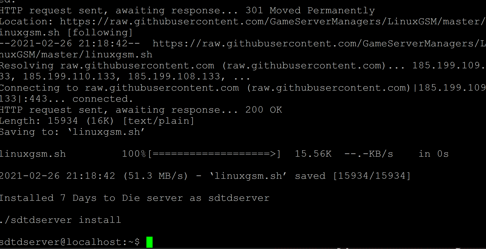
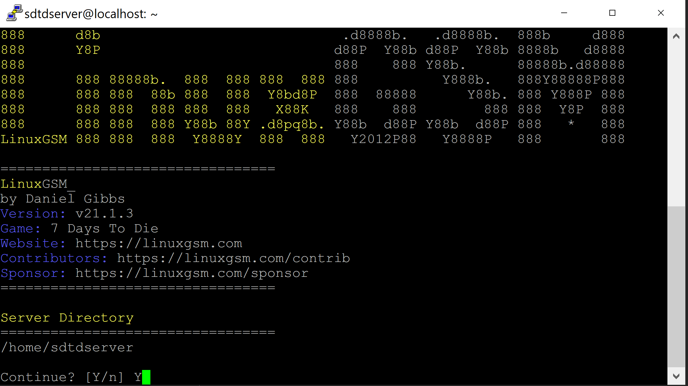
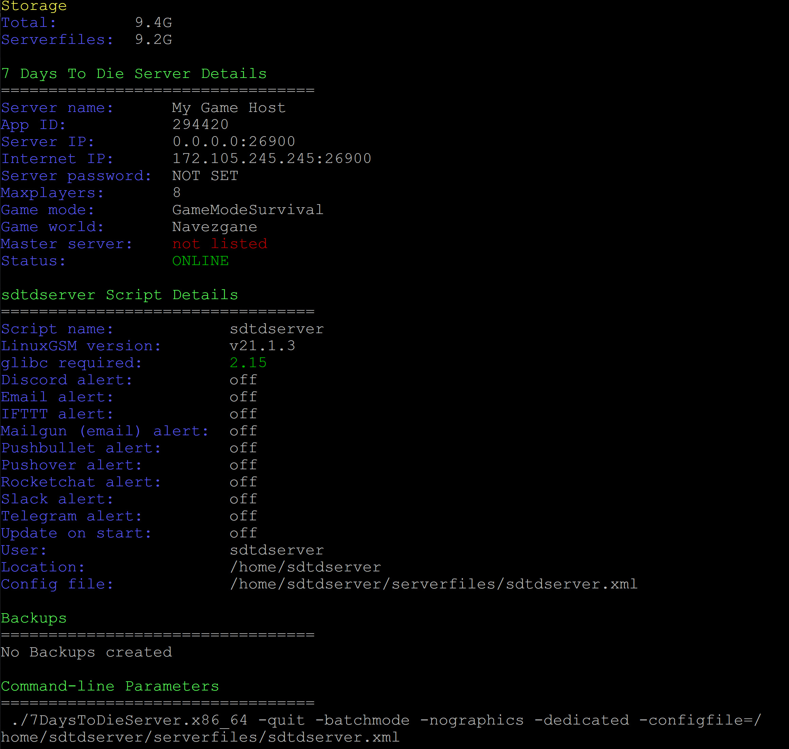
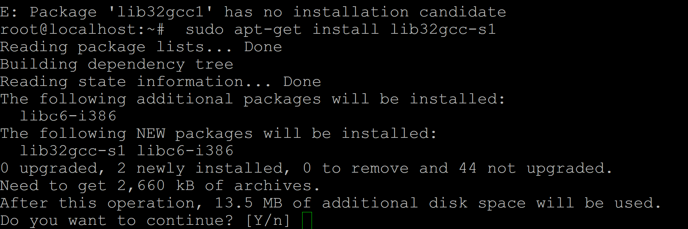
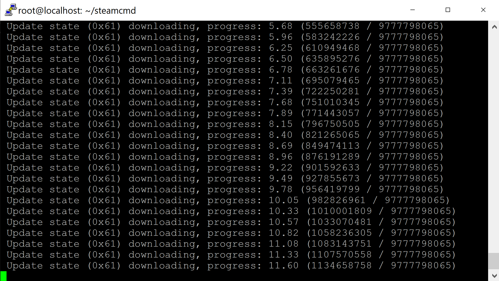
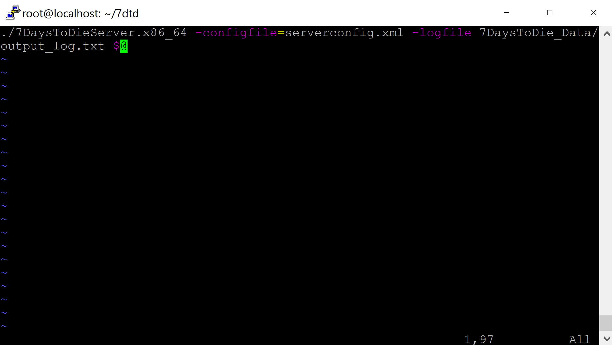

# How to set up a 7 Days to Die Server

The Zombie Horde Survival game [7 Days to Die](https://7daystodie.com/) (7DTD) is still going strong. Even eight years after its release, its community is alive and the zombie fun hasn&#39;t stopped.

The game is even better when you and your friends play on your own server, using your own rules. Plus, when you [host a game server yourself](https://www.linode.com/docs/guides/game-servers/linux-game-server/index.md), you don&#39;t have to worry about lag time – thanks to Linode.

This guide shows you how to set up your own 7DTD server, both using LinuxGSM and manually.


## Creating a game server with LinuxGSM

The Linux Game Server manager ([LinuxGSM](https://linuxgsm.com/)) helps you set up a server. With a few scripts, it also allows you to fine-tune "7 Days to Die."

To get started with LinuxGSM, install the following dependencies.

```
sudo dpkg --add-architecture i386
sudo apt update
sudo apt install curl wget file tar bzip2 gzip unzip bsdmainutils python util-linux ca-certificates binutils bc jq tmux netcat lib32gcc-s1 lib32stdc++6 steamcmd telnet expect
```

This installs Steam among other things required for the server. You might need to click on `OK` to confirm the Steam EULA.

Next, create a user and a login for your 7 Days to Die Server:

```
adduser sdtdserver
adduser sdtdserver sudo
su – sdtdserver
```

Type in a password of your choice and then download LinuxGSM:

```
wget -O linuxgsm.sh https://linuxgsm.sh && chmod +x linuxgsm.sh && bash linuxgsm.sh sdtdserver
```



Then run the game script installer using the following command:

```
./sdtdserver install
```



 Click on `Y` when prompted.

At this point, you might be told about missing dependencies, which LinuxGSM then adds.

With LinuxGSM set up, it then downloads the game, &quot; **7 Days to Die**.&quot; Once that&#39;s done you can launch it by typing:

```
./sdtdserver start
```

Done! To check if your server is online, type:

```
./sdtdserver details
```

 Hopefully, you see the following information:

 

 Does it say **ONLINE** after Status? Then you and your friends are good to go!

Last but not least: Fire up the game and try to connect to the IP of your Linode server:


To get a list of all available commands, simply type in `./sdtdserver`! All that&#39;s left to say now is: Happy slashing!

## Creating a game server manually

You can also set up &quot;7 Days to Die&quot; on a server without LinuxGSM. Here&#39;s how:

For this example, we use an Ubuntu Server created with Linode to host the 7 Days To Die server. As always, you need to create a Linode server and connect to it via Putty for Windows or using Terminal for Mac/Linux.

First, run all the updates:

```
sudo get-apt update
```

But before you reboot the system, install a couple of libraries to get 7 Days to run.

First, install the `lib32gcc-s1` library:

```
sudo apt-get install lib32gcc-s1
```



Choose `Y` to confirm when the installation prompts you to do so.

**Next, install Steam.** Before you do so, be sure to [read the intro guide for setting up a game server](https://www.linode.com/docs/guides/game-servers/linux-game-server/index.md) for background.

Then use the following commands to install Steam and log into your account:

```
sudo mkdir steamcmd
cd steamcmd
sudo wget http://media.steampowered.com/installer/steamcmd_linux.tar.gz
tar -xvzf steamcmd_linux.tar.gz
sudo ./steamcmd.sh
```

Once that's complete:

```
login username password
```

Next, install **7 Days to Die**. If you haven&#39;t purchased it yet…now is the time!

```
force\_install\_dir ../7dtd
app\_update 294420 validate
```

Expect it to take some time. Since 7DTD is roughly a 10 GB install, you might want to grab a coffee while your Linode server downloads and installs the game.



Once done, type in `Quit` to exit SteamCMD.

To run the server, create a 7 Days to Die startup script. To do that, switch into the 7DtD directory:

```
cd ../7dtd
```

Type in the following command to create a startup script:

```
sudo vim startup.sh
```

Add the following script to the `sh` file:

```
./7DaysToDieServer.x86_64 -configfile=serverconfig.xml -logfile 7DaysToDie_Data/output_log.txt $@
```

 It should look like this.



 When that&#39;s done, press ESC to enter the vim command mode; type in `:w` to write the startup script and `q` to quit the editor.

Finally, change the permission for this script:

```
sudo chmod +x startup.sh
```

It&#39;s time to run the game! Finally, launch the game server:

```
screen -S 7dtd
sudo ./startup.sh
```

Last but not least: Fire up the game and try to connect to the IP of your Linode server:


All that&#39;s left to say now is: Happy slashing!
