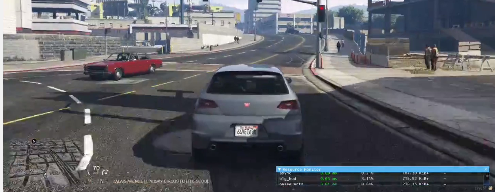
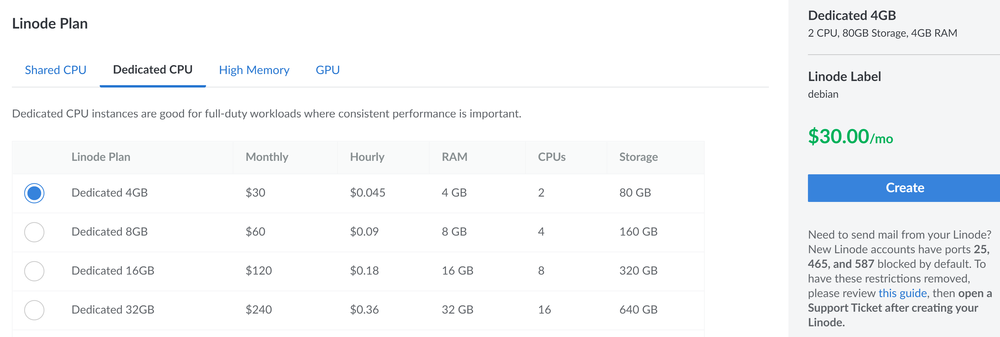
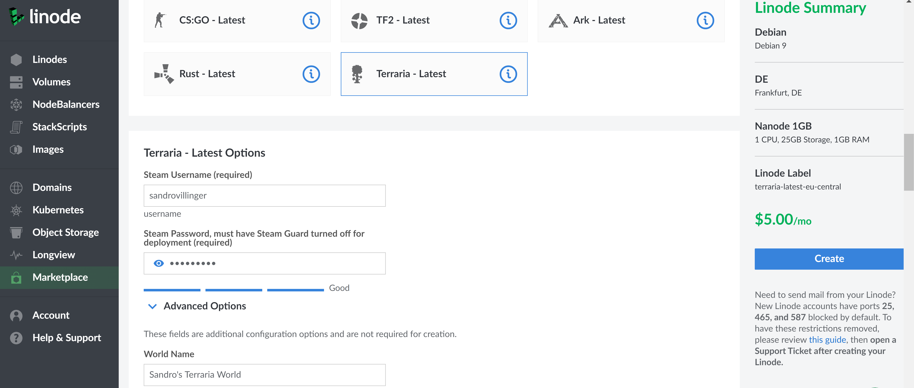
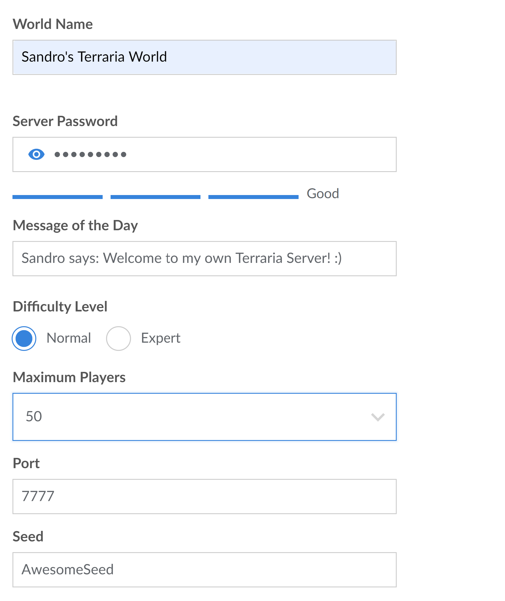
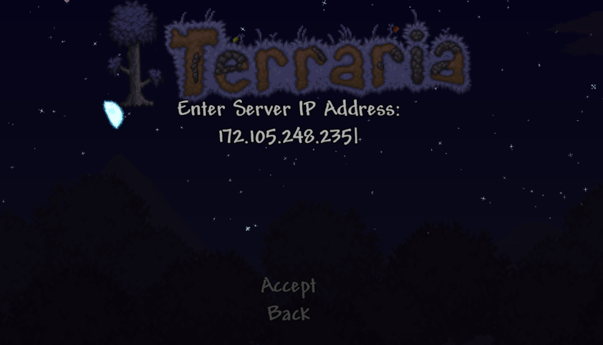
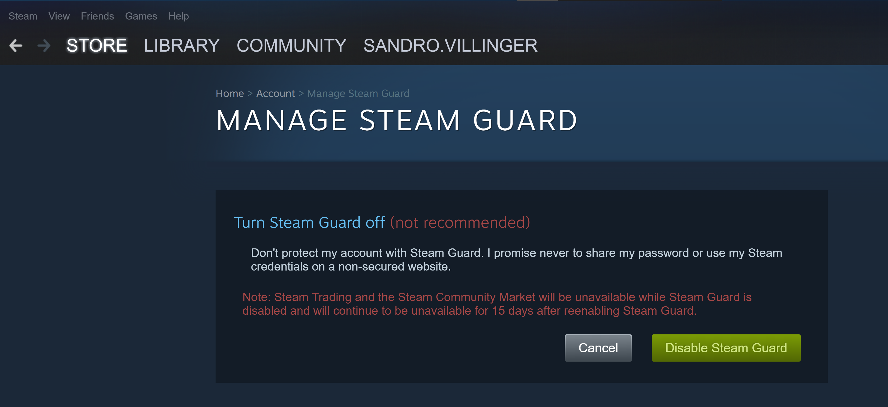
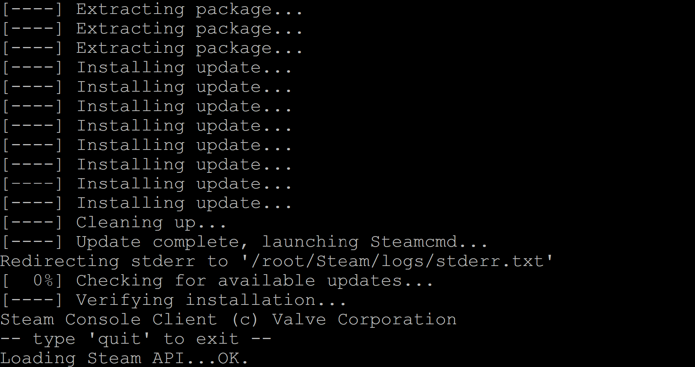

# Get started with Linux game server hosting

If you want the best gaming performance and lowest latency, or if you just want to play by your own rules, it&#39;s time you set up your own dedicated game server. You can do so for [Minecraft](https://www.linode.com/docs/guides/deploying-minecraft-with-marketplace-apps/), CS:GO, Grand Theft Auto&#39;s popular [FiveM](https://fivem.net/) mod, or any other multiplayer game that supports dedicated server hosting.

This guide helps you understand what is involved in setting up your own Linux game servers. It covers the top reasons for hosting your own game server, computing requirements, Linux distro recommendations, and setup advice.

## Three reasons why

Creating a dedicated gaming server seems like a daunting task, especially when the easiest option is to just join any server that's hosted by the game makers or various platforms. However, if you&#39;re really in love with a certain game, then hosting your own game server has massive benefits:

**You&#39;re in charge.** You get to say what&#39;s what. It&#39;s your sandbox and you decide who gets to join. You can just use Linode to host your friends – _and only your friends_!

You can also set the rules and add crazy customizations to your game. This can range from setting the balancing in CS:GO to hosting your own GTA V FiveM world with unique [scripts](https://github.com/FiveM-Scripts) that change your GTA V world into something entirely different, using new rules, jobs, overlays, and world principles.



_A small example of [a FiveM script](https://forum.cfx.re/latest): A dedicated HuD for any vehicle that shows the speed next to your world map. This is one of hundred scripts you – the master of worlds – can add._

**You get a lag-free experience.** High ping and latency can kill your gameplay – and your player characters. With high latency, your character can be hit before you realize someone was shooting at you. Hosting your own server near your location with a limited amount of gamers results in the best possible latency.

**You ensure the best-possible reliability.** If you use a dedicated server on Linode, you get dedicated resources for your game so nothing else can impact its reliability. In most cases, you won&#39;t host hundreds of thousands of players, so you shouldn&#39;t expect any downtime or poor performance caused by overload.

## System requirements: What do I need to get started?

The games themselves often require [dedicated GPUs](https://www.linode.com/docs/guides/getting-started-with-gpu/) and CPUs. However, the game server only need to handle your game&#39;s client-server requests. Even for higher-end games, such as GTA V FiveM, you should be fine with a decent quad-core server running with 4GB of RAM. A SSD, however, is a must; you want the server to handle requests from all gamers nearly instantaneously.

Linode&#39;s basic dedicated 4 GB plan comes with two CPUs, which should be plenty to support most dedicated game servers.



One possible exception is Minecraft which, especially when heavily modded, will chug through resources. It can even bring a 4-8 core server down to its knees when many users are actively playing.

Generic advice goes just so far, as each game and game size can have a massive impact on system requirements.

## Which Linux distribution is best for game hosting?

The general consensus in the gaming community is Debian or Ubuntu. Both offer rock-solid performance and everything you need to get a game server up and running.

Debian and Ubuntu also are designed to easily run headless without any shell (which can be added if needed) making it resource friendly. All your server resources can fully focus on the one game.

## Can I host my game server on Linode?

As mentioned above, yes, Linode can easily be used as a game server as long as you run a widely-supported Linux distribution such as Debian. In fact, Linode offers one-click gaming servers for some games, including Ark, Team Fortress 2 and Terraria. These can be found in the [marketplace](https://cloud.linode.com/linodes/create?type=One-Click):



All you need to do is enter your Steam user name, Steam Guard (more on that below), server password, the number of players allowed and specific rules:



Most importantly, choose a location geographically close to you and then go for a Linode tier. Again, if you&#39;re not hosting parties with hundreds of people you can easily try a shared server with one of the lower tiers and see how the performance holds up. You can always move to a higher performance tier later.

Once the server is created, launch the game on any PC and put in the IP address of your Linode server. This is where you find it:


For instance, in Terraria all you need to do is click on **Multiplayer, Join via IP** and then put in the IP address followed by `port 7777`. If you get a connection error, make sure NAT is enabled and that Port 7777 can go through the firewall:



Our YouTube channel has a video by developer Gardiner Bryant explaining [how to set up a Rust server through the Linode marketplace](https://www.youtube.com/watch?v=RPbIRbj0GyA).

However, if your game isn&#39;t available as one-click solution on the Linode marketplace, you need to do a little bit of prep work – and that depends on the game.

## What you should know when hosting your own Linode server

**For Steam games,** you need to disable the Steam Guard feature that asks you to verify a login from a new computer. It wouldn't work, because you can&#39;t see the 2FA code in your headless Linux server.

 To do this, open Steam on any PC and go to **Settings** , **Account**, and **Manage Steam Guard Account Security**. On the next page, click **Disable Steam Guard**.



For some games you also need a login token to set up a server and get it connected to Steam. Follow the advice on [this Steam page](https://steamcommunity.com/dev/managegameservers) to get such a token.

You also need to understand how to SSH onto your Linode; [this video](https://www.youtube.com/watch?v=ZVMckBHd7WA) explains the process in detail.

### Synchronize the repository

Make sure that the Linux depository is up-to-date.

```
sudo apt-get update
```

### Make sure you&#39;re running your server under a non-root account

For instance, to create a user for a 7 Days to Die server, log into your Linode server and type in:

```
adduser sdtdserver sudo
```

 To log into this account use

```
su – sdtdserver
```

From here you can continue setting up your game server.

### Check for dependencies

Most games need some of the following prerequisites and dependencies, which might or might not be installed already.

The prerequisites differ from game to game. To make life simpler, many popular games can be set up via [LinuxGSM](https://linuxgsm.com/lgsm/sdtdserver/), a command line tool that automates a lot of the process of installing Steam and its dependencies; it even downloads the game to your server. If you use LinuxGSM to set up a specific game, its website shows you which dependencies are necessary and usually downloads what&#39;s missing.

If they aren&#39;t included, these commands should bring things up to date.

Some of most important subsystems include:

- **Lib32gcc - needed for Steam CMD**

```
 sudo apt-get install lib32gcc-s1
```

- **Screen – needed to allow multiple terminal sessions**

```
 sudo apt-get install screen
```

Steam games have a few unique needs.

- The following steps are necessary to install and run Steam. SteamCMD is the command line server option for Steam required to run Steam games:

```
 sudo mkdir steamcmd
 cd steamcmd
 sudo wget
 wget [http://media.steampowered.com/installer/steamcmd\_linux.tar.gz](http://media.steampowered.com/installer/steamcmd_linux.tar.gz)
 tar -xvzf steamcmd\_linux.tar.gz
 sudo ./steamcmd.sh
 ```

 

OnceSteam is installed, you can log into your Steam account with the following command:

```
login username password
```

To make things easier, consult these dedicated guides for popular games to help you set up your own Linode server:

- [How to set up a 7 Days to Die Server](https://www.linode.com/docs/guides/game-servers/7dtd/index.md
)
- [Launch a Counter Strike: Global Offensive (CS:GO) server on Ubuntu 18.04](https://www.linode.com/docs/guides/launch-a-counter-strike-global-offensive-server-on-ubuntu-18-04/)
- [How to Setup a Terraria Linux Server](https://www.linode.com/docs/guides/host-a-terraria-server-on-your-linode/)
