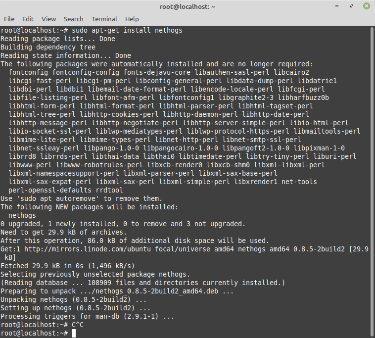
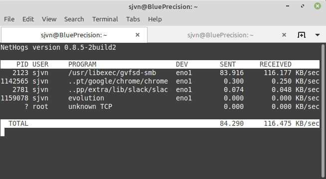
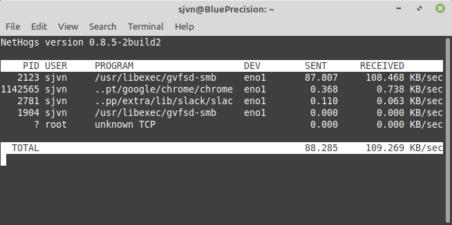

# Using nethogs

[Nethogs](https://github.com/raboof/nethogs) is a free, open-source program to track network usage. It extends the net top tool to track bandwidth by process. For example, `net top` may show that outbound traffic increased on a Linux server by protocol or subnet. But nethogs makes it easier for Linux adminstrators to identify which process is generating the usage spikes.

Nethogs gathers its data from the files within the `/proc/net` directories. It does not rely on a special kernel module or driver. It works on any Linux system, but it doesn&#39;t work well on other related server operating systems such as [FreeBSD](https://www.freebsd.org/).

Using the collected data, nethogs displays both `process IDs` (`PID`) and the program&#39;s name. This makes it easy to identify what programs may be misbehaving, by highlighting those that are using more than their fair share of available bandwidth.

When the Linux networking monitoring tool is started, nethogs displays current networking data. It picks up this data by using both `proc` data and [libpcap](https://man7.org/linux/man-pages/man3/libcap.3.html) for user-level packet capture. Nethogs then displays the data as a text-based chart, using [ncurses](https://linux.die.net/man/3/ncurses). As long as you have the program running in the foreground, the nethogs display is constantly updated.

## Installing nethogs – if necessary

Many Linux distributions come with nethogs already installed. If that&#39;s not the case, install it on Debian/Ubuntu systems using the command:

`sudo apt-get install nethogs`

That ensures nethogs is ready for root to run.

## The nethogs syntax

Nethogs is commonly run as an interactive program. But it also can be used in shell programs, or as a graphical program with the [nethogs-qt](http://slist.lilotux.net/linux/nethogs-qt/index_en.html) Qt-based GUI.

The nethogs Linux networking system monitoring program has simple syntax:

`nethogs [option] [port name]`

Nethogs defaults to constantly measuring traffic to and from the eth0 port when the utility is run without any options:

`sudo nethogs`

In the example below, nethogs reports an Ubuntu Linux workstation copying a Server Message Block (SMB) file from a Samba server, the Chrome web browser, a background Slack messaging client, and an idle Evolution e-mail client.

Use the `-d` flag to instruct nethogs to use a refresh rate. This is measured in seconds. For example, to refresh the display every five seconds:

`sudo nethogs -d 5`

To add a refresh rate of five seconds and &#39;device name&#39; to monitor the `eno1` device bandwidth use the command:

`sudo nethogs -d 5 eno1`

Nethogs can also be used to monitor multiple network ports at once. For instance, to collect data from both eth ports:

`sudo nethogs -d 5 eth0 eth1`

## Control nethogs interactively

While nethogs is running you can use the following interactive commands:

- **`-m`**: Change the units displayed for used network bandwidth: kilobytes/sec ->; total kilobytes -> total bytes-> total megabytes
- **`-r`**: Sort by magnitude of received traffic
- **`-s`**: Sort by magnitude of sent traffic
- **`-q`**: Hit quit to the shell prompt

For example, below is a nethogs display showing the traffic by total megabytes in received order.

It can be difficult to troubleshoot a Linux system that is behaving erratically. Using nethogs provides easy-to-read data that makes it much easier to spot the applications that are using more data than expected.