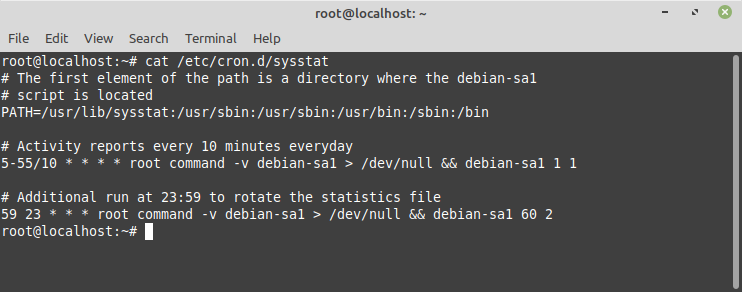
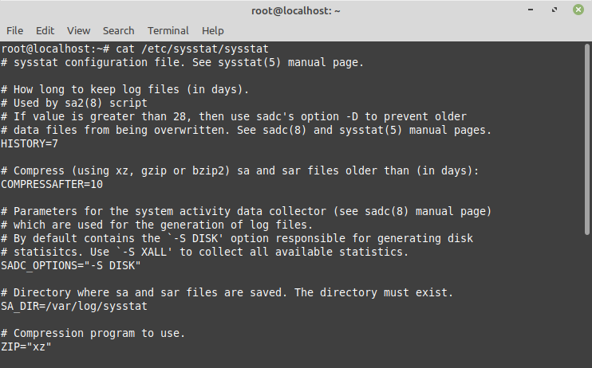
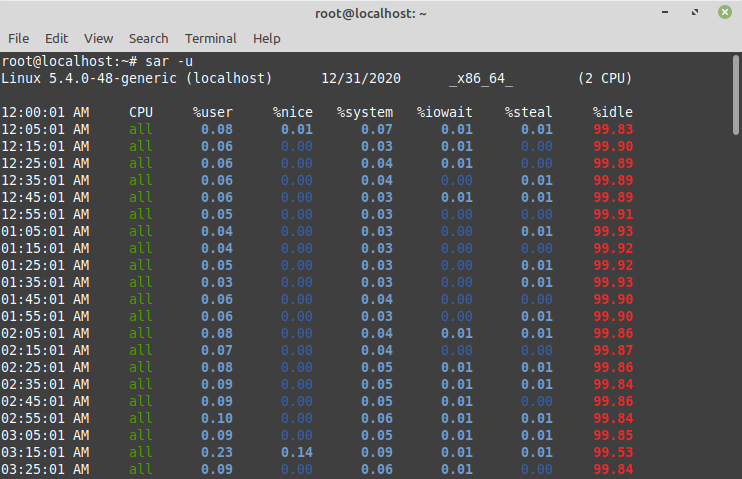
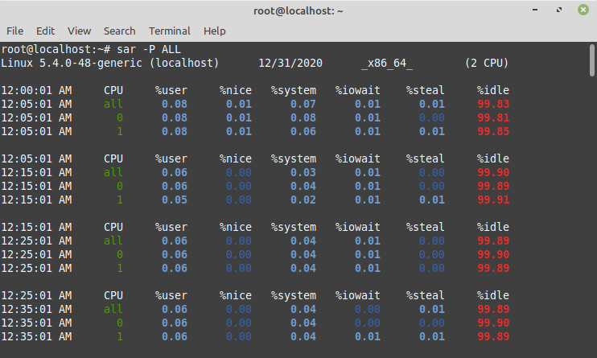
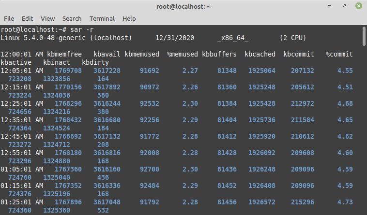
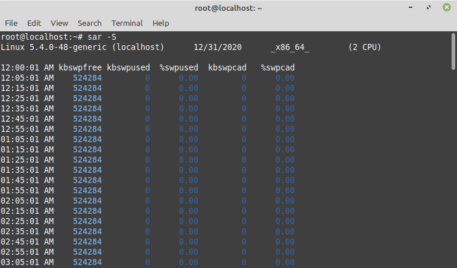
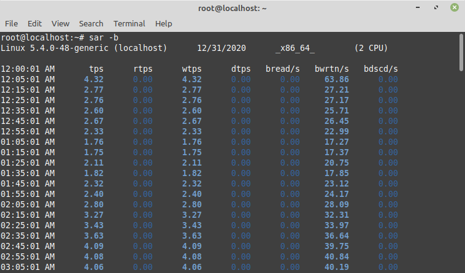

# Using sar

The System Activity Reporter ([Sar](https://linux.die.net/man/1/sar)) is a useful utility program for analyzing Linux system performance. Sar is a do-it-all monitoring tool that is part of the [Sysstat system resource utilities package](https://github.com/sysstat/sysstat).

Linux administrators should learn sar for its wide range of utility features. It measures CPU activity; memory/paging; interrupts; device load; network; process and thread allocation; and swap space utilization.

Data is gathered in the `/proc` filesystem. By default, sar collects data once for every 10-minute mark of each hour.

## First, install and configure sar

The open-source sar program is frequently used, but it's not included in most Linux distributions. You must install it as part of the `sysstat` package.

To install sar on the Debian/Ubuntu Linux family, type the command:

```
$ sudo apt-get install sysstat
```


However, sar doesn't collect data by default. You must update its configuration file before the utility does anything useful.

To do this, edit the file `/etc/default/sysstat` to change the value for `ENABLED` to true. Run vi, or your favorite editor, to change the configuration value:

```
$ sudo vi /etc/default/sysstat
```

And change `false` to `true`.

Other sar configuration data is kept in the files `/etc/cron.d/sysstat` and `/etc/sysstat/sysstat`.The defaults should work well for you, but at some point you may want to change them.

To see your current sar settings, run:

```
$ sudo cat /etc/cron.d/sysstat

$ sudo cat /etc/sysstat/sysstat
```

To change these sar settings, modify the files with your favorite text editor, such as:

```
$ sudo vi /etc/cron.d/sysstat
```

A typical `/etc/cron.d/sysstat` file looks like this:



The most commonly modified variable is the frequency setting for how often sar runs. It is controlled by the line:

```
5-55/10 \* \* \* \* root command -v debian-sa1 \&gt; /dev/null &amp;&amp; debian-sa1 1 1
```

By default, the `debian-sa1` script runs every 10 minutes and collects sar data for historical reference. This data is written to the `/var/log/sa/saXX` file, where `XX` is the day of the month. For example, if today is the 24th day of the month, `sa1` writes the sar data to `/var/log/sysstat/sa24`. Note that the `saXX` file is a binary file; a text editor can't display `saXX` files properly.

To change the logging frequency to one minute, change 5-55/10 to 5-55/1. To make it 2 minutes, change it to 5/55/2, and so on.

Now look at the second configuration file:

```
$ sudo vi /etc/sysstat/sysstat
```

Frequently-used variables are set in the `/etc/sysstat/sysstat` file. These include for how long log files should be kept; when log files should be compressed; and which compression algorithm should be used.

Below is a typical `/etc/sysstat/sysstat` file:



## Using sar

You can run sar both as an interactive program and in shell programs.

There are two ways to run sar:

- `sar` followed by an option, without a saXX data file. This command displays to the standard output (`stdout`) the current day's saXX data.
- `sar` followed by an option, and additionally specifying a saXX data file using the `-f` flag. This reports the performance data for that particular day.

For example, issuing this command displays the cumulative real-time CPU usage of all CPU cores on the 24th day of the current month:

```
$ sudo sar -u -f /var/log/sysstat/sa24
```

In these examples, the command syntax is for the current day. To display data for a particular day, add `-f /var/log/sysstat/saXX` at the end of the sar command with XX replaced by the day of the month.

All the sar commands show the following as the first line in its output. For these screen-shot examples, you see the current values:

- **Linux 5.4.0.48-generic**: the Linux kernel version
- **(localhost)**: The hostname where the sar data was collected
- **12/31/2020**: The date when the sar data was collected
- **\_x86\_64**: The system architecture
- **(2 CPU)**: Number of CPU cores available



As is typical for powerful utilities, you can get basic information or you can delve deep into the system. For example, you might want to know if your server is suffering from a spike in activity on a given date, during a particular time, or an earlier date.

Here are some simple, useful sar examples to illustrate the information you can gather.

### See all CPU Usage (sar -u)

- `sar -u:`: Displays CPU usage for the current day collected until that point
-  `sar -u 1 3`: Displays real-time CPU usage every second for three times
- `sar -u -f /var/log/sysstat/sa24`: Displays CPU usage for the month&#39;s 24th day

### Display CPU Usage of each CPU or Core (sar -P)



- `sar -P ALL`: Displays current day CPU usage by all cores
- `sar -P ALL 1 3`: Displays real-time CPU usage for ALL cores every second for three times
- `sar -P 1`: Displays CPU usage for core number 1 for the current day. Cores are counted starting with 0.
- `sar -P 1 1 3`: Displays real-time CPU usage for core number 1, every second for three times.
- `sar -P ALL -f /var/log/sysstat/sa24`: Displays CPU usage broken down by all cores for the month&#39;s 24th day.

### Display free, available, and used memory (sar -r)



- `sar -r`: Displays free memory, kbmemfree; available memory, kbavail; and used memoryfor current day.
- `sar -r 1 3`: Displays memory use for every second for the last three seconds.
- `sar -r -f /var/log/sysstat/sa24`: Displays memory use on the 24th day of the current month.

### Swap Space Used (sar -S)



- `sar -S`: For the current day, sar displays free swap memory, kbswpfree; available swap memory, kspaused; and percentage of swap memory used, %swpsused.
- `sar -S 1 3`: Displays swap memory data for every second for the last three seconds.
- `sar -S -f /var/log/sysstat/sa24`: Displays swap memory use on the 24th day of the current month.

### I/O Transactions (sar -b)



Common `sar -b` commands:

- `sar -b`: Displays I/O transactions for the current day: tps; read/write transactions per second; rtps; read transactions per second; wtps; write transactions per second; bread/s; bytes read per second; bwrtn/s; bytes written per second; and discarded memory blocks per second, bdscd/s.
- `sar -b 1 3`: Displays I/O transactions data for every second for the last three seconds.
- `sar -b -f /var/log/sysstat/sa24`: Displays I/O transaction data on the 24th day of the current month.

### Going further

There are numerous other sar commands, options, and flags. See the [sar Linux manual pages](https://linux.die.net/man/1/sar) for more information.