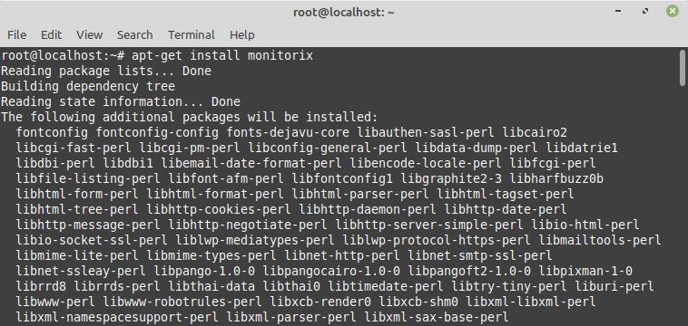
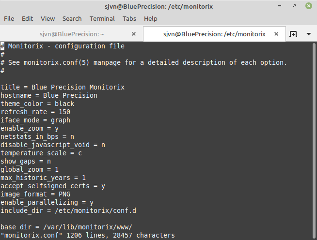
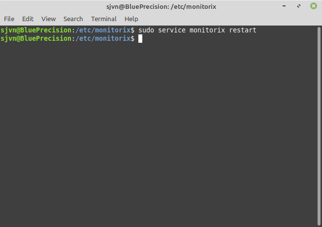
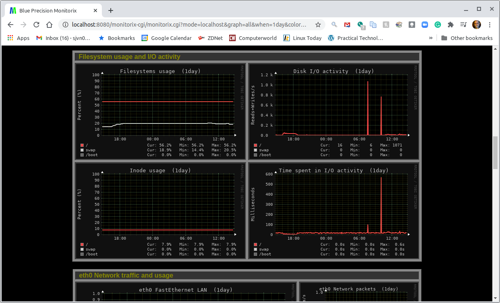

# Using Monitorix

[Monitorix](https://www.monitorix.org/) is a free, open-source system monitoring tool that keeps track of several Linux services and system resources. This guide shows how to use it.

The Linux system monitoring tool is composed of two programs. The first, monitorix, is a system data logging daemon written in [Perl](https://www.linode.com/docs/guides/development/perl/). The second, its web interface, uses the CGI script, `monitorix.cgi`.

Besides tracking Linux server elements such as overall system load, filesystem activity, and global kernel usage, Monitorix also tracks hardware data such as sub-system temperatures, battery status, and UPS statistics. It also monitors popular third-party Linux programs such as mail servers; [libvirt](https://libvirt.org/)-based virtual machines; and [MySQL](https://www.mysql.com/), [Nginx](https://www.linode.com/docs/guides/web-servers/nginx/), and [MongoDB](https://www.linode.com/docs/guides/databases/mongodb/) databases.

Monitorix was originally designed for the [Red Hat Enterprise Linux](https://www.redhat.com/en/technologies/linux-platforms/enterprise-linux) operating system family. Now, licensed under the GPLv2, it works on all major Linux server distributions. Beginning with version 3.0, Monitorix comes with its own web server, which is useful for remote Linux server monitoring. With its simple graphical interface, it&#39;s also good for interactive server monitoring.

## Installing Monitorix

Monitorix is not installed on Linux servers by default; you need to install it explicitly. On the Debian/Ubuntu Linux family run the command:

`sudo apt-get install`

Monitorix ships with a default configuration file, `monitorix.conf`. The monitorix daemon automatically reads `/etc/monitorix/monitorix.conf` and uses its settings at launch. Most of the time, the default configuration is appropriate. There are over two dozen setting groups. Most of these are for specific hardware configurations, such as NVIDIA card temperatures, file systems (e.g, [ZFS pools](https://www.ixsystems.com/blog/zfs-pools-in-freenas/)), or programs such as [sendmail](https://www.proofpoint.com/us/products/email-protection/open-source-email-solution), [Postfix](http://www.postfix.org/), and [Exim](https://www.exim.org/) mail servers. To fine-tune your installation, read [Monitrox&#39;s manual pages](https://www.monitorix.org/documentation.html) and edit the `/etc/monitorix/monitorix.conf` file:

`su vi /etc/monitorix/monitorix.conf`

On Debian/Ubuntu Linux systems, an additional configuration file, `/etc/monitorix/conf.d/00-debian.conf` includes some Debian/Ubuntu-specific options. This file is read after the main configuration file, so the changes you make may supersede `monitorix.conf` options.

Once you&#39;re done configuring Monitorix, restart the Monitorix service to enable the updates to take effect.

By default, Monitorix uses its built-in web server. However, it can be set to work with the [Apache](https://www.linode.com/docs/guides/web-servers/apache/), [Lighttpd](https://www.linode.com/docs/guides/web-servers/lighttpd/), or Nginx web servers.

## Getting started with Monitorix

Monitorix is meant to be used as an interactive program. It&#39;s not suitable for use in shell programs.

The default top graph shows system load, memory allocation, active processes, [entropy](https://hackaday.com/2017/11/02/what-is-entropy-and-how-do-i-get-more-of-it/), and uptime. This is useful for seeing the current condition of your primary CPU and memory performance.

Continuing down the display are graphs showing global kernel use; kernel context switches and forks; Linux Virtual File System (VFS) usage; and kernel usage per processor/core.

This is followed by a display of filesystem usage and I/O activity.

Next, comes network activity measurements.

Finally, Monitorix displays logged-in user measurements and device interrupt activity.

Change the settings in the `/etc/monitorix/monitorix.conf` file to rearrange Monitorix&#39;s Linux server monitoring charts or to add more charts.

## Beyond the basics

The Monitorix daemon stores its log files by default to `/var/log/monitorix`. The data within these logs are typically displayed by the built-in web server. Monitorix&#39;s default web address is `http://localhost:8080/monitorix-cgi/monitorix.cgi`.

For authentication, Monitorix uses [HTTP Basic access authentication](https://www.linode.com/docs/guides/apache-access-control/#the-caveats-of-http-authentication). Users&#39; passwords are set using the [htpasswd.pl script](https://docs.nginx.com/nginx/admin-guide/security-controls/configuring-http-basic-authentication/).

The Monitorix web interface can also [monitor multiple Linux servers](https://www.monitorix.org/documentation.html#58).

You can automate some of the data the Linux monitoring tool collects. System administrators can automatically [send selected graphs in a report to an email address](https://www.monitorix.org/documentation.html#59), for example. The default Monitorix installation also includes an example of a monitoring alert, `monitorix-alert.sh`. Use this script to [set up e-mail alerts](https://www.monitorix.org/documentation.html#8) for higher-than-expected CPU usage.

In short, Monitorix is a useful and very flexible Linux system monitoring program. With its power to monitor the operating system, some programs, and hardware, you may find it an ideal addition to your system administrator tool kit.